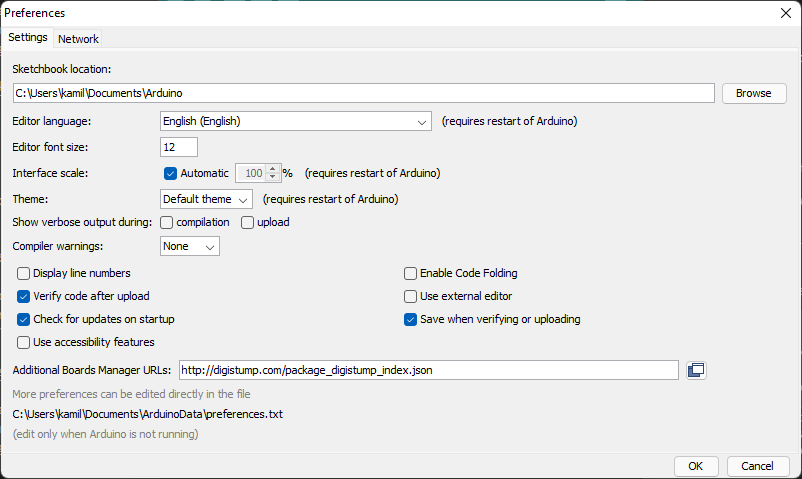
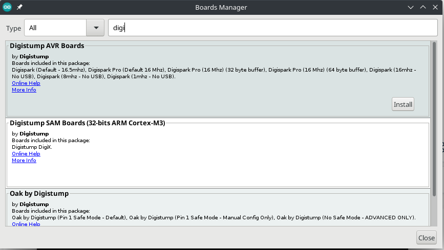

# "Watykanczyk" Project
> "Watykanczyk" is a script that will allow you to make life difficult for your peers and bring a smile to their faces.

## Table of Contents
* [**General Information**](#general-information)
* [**Technologies Used**](#technologies-used)
* [**Features**](#features)
* [**Getting Started**](#getting-started)
* [*Windows system*](#windows-system)
* [*Linux system*](#linux-system)
* [**Usage**](#usage)
* [*Warning*](#warning)
* [**Contact**](#contact)

## General Information
- Use the script in accordance with the laws of your region.
- Use the script only on your devices.
- The project is created out of boredom, so it may contain errors and imperfections.

## Technologies Used
- [Attiny85 USB Board](https://bit.ly/3qYtzW8)  (called Digispark)
- [Arduino IDE Software](https://www.arduino.cc/en/software)
- Windows PC - Victim

## Features
- When the board is pressed into the USB port, it plays the song "Wapiesz - hehe papież tańczy". 
- Displays pictures of the pope's favorite treat.
- Invokes a command to turn off the computer when the music ends.
- Opens 20 new tabs in the browser.
- Opens https://www.windows93.net/ in full screen.

## Getting Started
Here are all the steps to install "Watykanczyk" on your board and run it.

### **WINDOWS SYSTEM**

### Prerequisites
Here are all the steps you need to follow before installing the script on the board.
1. To begin, you need to download the [Arduino IDE](https://www.arduino.cc/en/software). Choose 32 or 64 bit version depending on your machine. You can do this using the manufacturer's official website.
2. Now you need to open the .exe file and install it.
3. If the program has been installed correctly, run it.
4. Then click **File > Preferences** and in place of **Additional Boards Manager URLs** type the following link and click OK:
```
http://digistump.com/package_digistump_index.json
```




5. Now go to **Tools > Board > Boards Manager** - find and install Digistump AVR Boards item. Then close the Arduino IDE environment.


6. Now you need to install Digispark drivers. Download the Digistump.Drivers file from my repository and install the DPinst64.exe driver.


7. Now open the Arduino IDE environment. Select `Digispark (Default - 16.5mhz)` from **Tools > Board > Digistump AVR Boards**.


### Installation
Here I will describe all the steps to test your board and upload my script.
1. Go to **File > Examples > Digispark_Examples** and select **Start**.


2. Now press the upload button in the upper left corner. When the message **"Plug in device now..."** is displayed insert the board.


3. If everything is successful and the board starts flashing, it means that the program has been configured correctly.


4. Now you can proceed to install my script. Clone the Github repository, unzip it and run **attiny85-watykanczyk/attiny85-watykanczyk.ino** file. Upload the script and have fun ;)

### **LINUX SYSTEM**

### Prerequisites
Here are all the steps you need to follow before installing the script on the board.
1. To begin, you need to download the [Arduino IDE](https://www.arduino.cc/en/software). Choose 32 or 64 bit version depending on your machine. You can do this using the manufacturer's official website.
2. Now you need to extract the archive and run the terminal in the folder where the installation files are located.
3. Now type the command `sudo ./install.sh` and wait for the program to install.


4. If the program has been installed correctly, run it.
5. Then click **File > Preferences** and in place of **Additional Boards Manager URLs** type the following link and click OK:
```
http://digistump.com/package_digistump_index.json
```


6. Now go to **Tools > Board > Boards Manager** - find and install Digistump AVR Boards item. Then close the Arduino IDE environment.




7. Now we need to create a file for udev that will allow us to communicate the micronucleus bootloader, uploaded to digispark, with the Arduino IDE. The easiest way to do this is from a terminal, which is:
```sh
sudo vim /etc/udev/rules.d/49-micronucleus.rules
```
8. You have to paste this text as the content of the file:
```sh
# UDEV Rules for Micronucleus boards including the Digispark.
# This file must be placed at:
#
# /etc/udev/rules.d/49-micronucleus.rules    (preferred location)
#   or
# /lib/udev/rules.d/49-micronucleus.rules    (req'd on some broken systems)
#
# After this file is copied, physically unplug and reconnect the board.
#
SUBSYSTEMS=="usb", ATTRS{idVendor}=="16d0", ATTRS{idProduct}=="0753", MODE:="0666"
KERNEL=="ttyACM*", ATTRS{idVendor}=="16d0", ATTRS{idProduct}=="0753", MODE:="0666", ENV{ID_MM_DEVICE_IGNORE}="1"
#
# If you share your linux system with other users, or just don't like the
# idea of write permission for everybody, you can replace MODE:="0666" with
# OWNER:="yourusername" to create the device owned by you, or with
# GROUP:="somegroupname" and mange access using standard unix groups.
```
Instead of vim you can use other text editor, for example popular nano, the file looks like this:


9. Now you need to reload udev with the following command:
```sh
sudo udevadm control --reload-rules
```
10. Select `Digispark (Default - 16.5mhz)` from **Tools > Board > Digistump AVR Boards**.


### Installation
Here I will describe all the steps to test your board and upload my script.
1. Go to **File > Examples > Digispark_Examples** and select **Start**.


2. Now press the upload button in the upper left corner. **If you get an error related to libusb you need to run the following command:**
- on `Debian, Ubuntu, Mint`
```sh
sudo apt-get install libusb-dev
```
- on `Fedora, CentOS`
```sh
sudo dnf install libusb
```
3. When the message **"Plug in device now..."** is displayed insert the board.


4. If everything is successful and the board starts flashing, it means that the program has been configured correctly.


5. Now you can proceed to install my script. Clone the Github repository, unzip it and run **attiny85-watykanczyk/attiny85-watykanczyk.ino** file. Upload the script and have fun ;)

## Usage
Stick the board into any Windows computer and wait for the magic to happen.

### Warning!
The script may not work properly if:
- the computer is too slow
- there is no default browser set on the victim's computer
- someone is using the computer while the script is running

## Contact
Created by [@KamilSuchecki](https://github.com/KamilSuchecki) - feel free to contact me!

You can also contact me by e-mail `kamilsuchecki81@gmail.com`